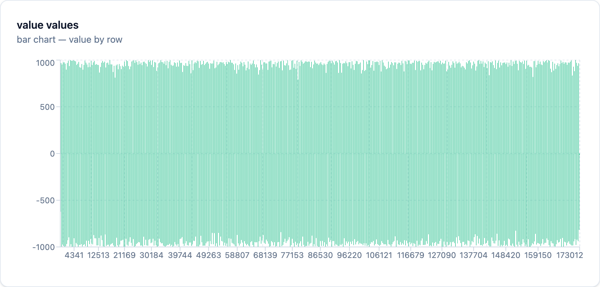

The English README is below.

注意！

動かしたことがないのに「う、うおーwwww『Don't roll your own crypto』も知らんの？？wwwww」とか頭ごなしに言うやつはベンチマークしてから物事言ってください。

全部読んでね全部大事だから。
# JRNG-JitterRandomNumberGenerator
## はじめに
外部ライブラリ一切使ってません！標準で動作します！！pip要りません！！！！

pythonファイル1個のみで動作します！さらに構文もシンプル！無駄に圧縮してないよ！！
## 仕様
微細なsleep関数によるOSやハードウェアのジッターを読み取ってナノ秒単位の取得によりエントロピーとカオスを生み出します！

PRNGベースなのにとても優秀！！固定のシードに依存しません！！！物理空間のノイズを取って自動生成のシードに組み込んでます！！

QRNGを追い抜く強さ！100%ソフトウェア駆動で99.99...%の極限みたいに完全なカオスを雪崩効果とナノ秒単位の取得で提供！！
## 注意点
なるべく冷却せずに安いボロスペックのPCを使って起動してください。ジッターが狭まってエントロピーが取れなくなります。

「ハイエンドしか持ってない！100%ソフトウェア駆動は嘘なのか！！」という方、安心してください。dockerコンテナなどの設定をクソスペックにした仮想環境にぶち込んだらOK！！

75段を10000bitで回した結果: [算出1〜3分(なんなら多分3分より短い) | 検証場所の性能CPU0.1コアRAM128MBのDocker | 1回目 - 49.99999999999862:49.99999999999862 | 2回目 - 49.34999999999875:50.64999999999849]

***

ダウンロードするファイルはここの上のpythonファイルです！本体なんで！

[気に入ってくれたらでいいんでコーヒー奢ってくれると嬉しいです！](https://ko-fi.com/milklattehastra5020)

***
EN
***

Warning!

If you’ve never even run this and are just jumping in with comments like, “Whoa, lol… You don’t even know ‘Don’t roll your own crypto’?? lololol,” please run a benchmark before you say anything.

Please read the whole thing—every part is important.
# JRNG-JitterRandomNumberGenerator
## Introduction
It doesn’t use any external libraries at all! It runs with the standard library!! No pip required!!!!

It runs with just a single Python file! Plus, the syntax is simple! I didn’t compress it unnecessarily!!
## Specifications
It reads OS and hardware jitter using a fine-grained sleep function and generates entropy and chaos by acquiring data in nanoseconds!

It’s incredibly powerful despite being PRNG-based!! It doesn’t rely on a fixed seed!!! It captures noise from the physical environment and incorporates it into the automatically generated seed!!

Powerful enough to outperform QRNGs! 100% software-driven, it delivers near-perfect chaos—approaching the limit of 99.99...%—through the avalanche effect and nanosecond-level sampling!!
## Important Notes
Please run this on a cheap, low-spec PC without cooling it as much as possible. Cooling narrows the jitter, making it impossible to capture entropy.

If you're thinking, “I only have high-end hardware! Is this ‘100% software-driven’ claim a lie?!”—don't worry. Just throw your Docker containers and other configurations into a virtual environment with crappy specs, and you're good to go!!

Results from running 75 stages at 10,000 bits: [Calculation time: 1–3 minutes (probably less than 3 minutes) | Test environment: Docker with 0.1 CPU cores and 128 MB RAM | 1st run - 49.99999999999862:49.99999999999862 | 2nd run - 49.34999999999875:50.64999999999849]

***

The file to download is the Python file at the top of this page! That’s the main program!

[If you like it, I’d be happy if you’d buy me a coffee!](https://ko-fi.com/milklattehastra5020)

***
### 画像資料(portfolio)
***

